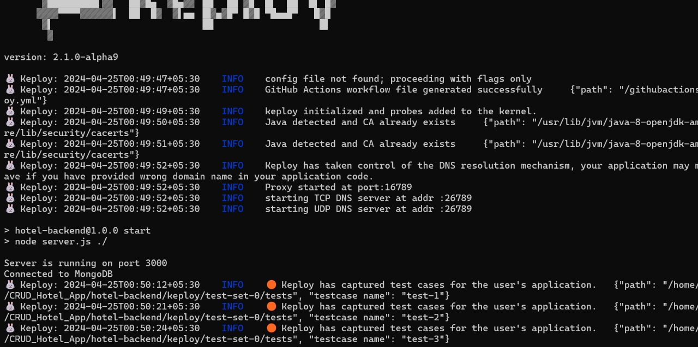
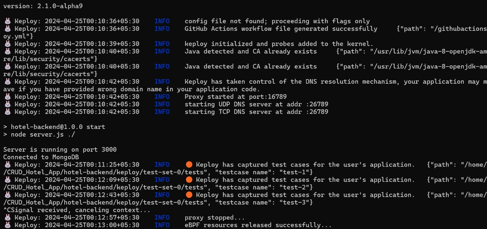

#   Hotel Management Web App

This is a sample Hotel Management application used to demonstrate Keploy's capabilities for capturing and replaying API tests.

1. **Node.js (version 14 or later):** Download and install it from [https://nodejs.org/en](https://nodejs.org/en).
2. **npm (version 5.6 or later):** This usually comes bundled with Node.js. Verify by running `npm -v` in your terminal.
3. **Docker:** Required to run the MongoDB instance.

**1. Clone the Repository and Install Dependencies:**

```bash
git clone https://github.com/keploy/samples-typescript && cd samples-typescript/express-mongo_Rohit_yadav
npm install
```

**2. Run the Development Server:**
Run the following command to launch the development server:

```bash
npm run dev
```

# Different  Jest Api Test cases

##   Test Case 1: View Bookings

```javascript

test('View Bookings - Success', async () => {
  const response = await axios.get('http://localhost:3000/bookings/view', {
    headers: {
      'Content-Type': 'application/json'
    },
    params: {
      roomNumber: "1",
      roomType: "A",
      startTime: "2024-03-07T00:00:00Z", // Adjust startTime and endTime if necessary
      endTime: "2024-03-08T00:00:00Z"
    }
  });

  expect(response.status).toBe(200);
  expect(response.data.bookings.length).toBeGreaterThan(0); // Adjusted expectation
});


```

##   Test Case 2: Edit a Booking

```javascript
test('Edit a Booking - Success', async () => {
  const requestBody = {
    userEmail: "new_email@example.com",
    roomNumber: "101",
    startTime: "2024-04-23T09:00:00Z",
    endTime: "2024-04-23T11:00:00Z"
  };

  const response = await axios.put('http://localhost:3000/edit/{id}', requestBody, {
    headers: {
      'Content-Type': 'application/json'
    }
  });

  expect(response.status).toBe(200);
  expect(response.data.message).toEqual("Booking updated successfully");
});

```

##  Test Case 3: Cancel a Booking

```javascript
test('Cancel a Booking - Success', async () => {
  const response = await axios.delete('http://localhost:3000/cancel/{id}', {
    headers: {
      'Content-Type': 'application/json'
    }
  });

  expect(response.status).toBe(200);
  expect(response.data.message).toEqual("Booking cancelled successfully");
});
```

##  Test Case 4: View Bookings

```javascript
test('View Bookings - Success', async () => {
  const response = await axios.get('http://localhost:3000/bookings/view', {
    headers: {
      'Content-Type': 'application/json'
    },
    params: {
      roomNumber: "101",
      roomType: "single",
      startTime: "2024-04-23T00:00:00Z",
      endTime: "2024-04-24T00:00:00Z"
    }
  });

  expect(response.status).toBe(200);
  expect(response.data.bookings.length).toBeGreaterThan(0); // Assuming there are bookings for the specified criteria
});

```

# How to run above Test Cases with keploy
 
#### Windows Subsystem for Linux (WSL)

On Windows, WSL is required to run Keploy Binary. 

```bash
wsl --install
```

Once installed download and Install "Keploy Binary" :

```bash
curl --silent --location "https://github.com/keploy/keploy/releases/latest/download/keploy_linux_amd64.tar.gz" | tar xz -C /tmp

sudo mkdir -p /usr/local/bin && sudo mv /tmp/keploy /usr/local/bin && keploy --version
```

### Let's start the MongoDB Instance

```bash
docker-compose up -d
```

#### Linux Users (Ubuntu/Debian) Note

The default `docker.io` package may not include Docker Compose v2, which is required for running Keploy sample projects using Docker Compose.

To avoid errors, install Docker Compose v2 using:

```bash
sudo apt update
sudo apt install docker-compose-plugin
```

Then use `docker compose up` instead of `docker-compose up`.

> **Since we have setup our sample-app natively, we need to update the mongoDB host on line 41, in `db/connection.js`, from `mongodb://mongoDb:27017/Students` to `mongodb://127.0.0.1:27017/keploy`.**

### Capture the testcases

```bash
sudo -E env PATH=$PATH keploy record -c 'node src/app.js'
```

## we will get the output



## Running the testcases

```bash
sudo -E env PATH=$PATH keploy test -c 'node src/app.js' --delay 10

```




