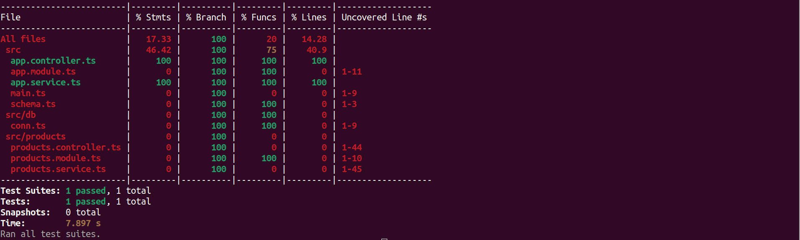
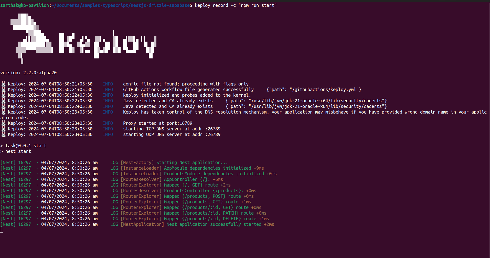
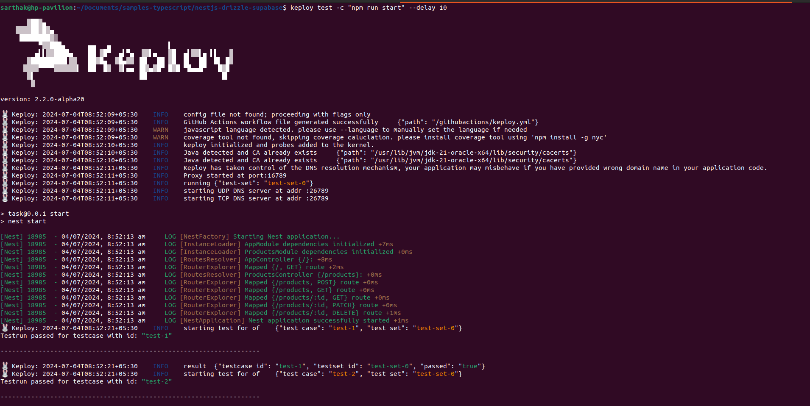
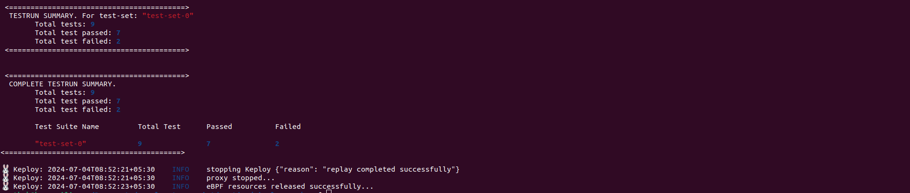
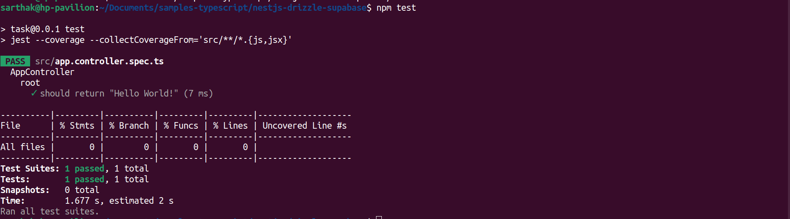
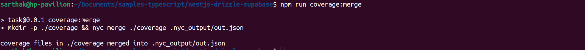
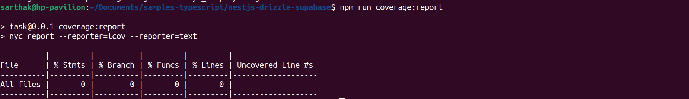

# NestJs + Drizzle  +Supabase

Tech STack - 
1. NestJs
2. Postgres
3. Supabase
4. Drizzle

### To install the dependencies
```
npm install
```

Create a .env
.env requires `DATABASE_URL` for the db ( we have used Postgres)

### Setup Drizzle MIgration
``` 
npm run generate
```

### Start the app
```
npm run start
```

### To run tests(about 80% of test coverage until now)
```
npm run test:cov
```


### Postman Collection of routes
https://dark-sunset-197753.postman.co/workspace/My-Workspace~8503974e-6cc0-4f18-8a0e-1599701fd834/collection/33233997-092cc06c-24ae-40bd-8252-70f74c57abe8?action=share&creator=33233997

### Keploy 

### Quick Installation

Let's get started by setting up the Keploy alias with this command:

```bash
curl --silent -O -L https://keploy.io/install.sh && source install.sh
```


### 🎬 Capturing Testcases

To initiate the recording of API calls, execute this command in your terminal:

```
keploy record -c "npm run start"
```


#### Let's generate the testcases.

Make API Calls using [Hoppscotch](https://hoppscotch.io), [Postman](https://postman.com) or cURL command. Keploy with capture those calls to generate the test-suites containing testcases and data mocks.

```bash
curl --request POST \
  --url http://localhost:3000/products \
  --header 'content-type: application/json' \
  --data '{
    "name": "Sample Product",
    "description": "This is a sample product",
    "cost": 100
  }'
```

### Create test cases using 

To run the testcases and see if there are any regressions introduced, use this terminal command:

```
keploy test -c "npm run start" --delay 10
```


### Summary



Great job following along 🥳! Now, let's dive deeper and explore how to do Keploy integration with application unit-test 📌

Update the package.json file that runs the application:

```json
  "scripts": {
    //other scripts
    "test": "jest --coverage --collectCoverageFrom='src/**/*.{js,jsx}'",
    "coverage:merge": "mkdir -p ./coverage && nyc merge ./coverage .nyc_output/out.json",
    "coverage:report": "nyc report --reporter=lcov --reporter=text",
    //other scripts
  }
```

To generate coverage report for your unit tests, Run:

```bash
npm test
```

To merge coverage data of unit tests with keploy tests, Run:

```bash
npm run coverage:merge
```


To get coverage related information for merged coverage data, Run:

```bash
npm run coverage:report
```



