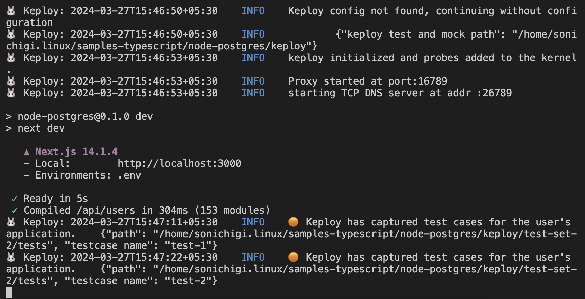

# Node-Postgres

A simple User management application to test using Keploy build with NextJS and Postgres.

## Setup application
Clone the repository and move to express-mongo folder
```bash
git clone https://github.com/keploy/samples-typescript && cd samples-typescript/nextjs-postgres

# Install the dependencies
npm install
```

Keploy can be installed on Linux directly and on Windows with the help of WSL. Based on your system architecture, install the keploy latest binary release from here:-
### Let's start the MongoDB Instance
```zsh
docker-compose up -d
```

### Capture the testcases

```bash
sudo -E env PATH=$PATH keploy record -c 'npm run dev'
```

#### Let's generate the testcases.
Make API Calls using [Hoppscotch](https://hoppscotch.io), [Postman](https://postman.com) or cURL command. Keploy with capture those calls to generate the test-suites containing testcases and data mocks.

```bash
curl -X POST -H "Content-Type: application/json" -d '{"name":"John","email":"doe@example.com"}' http://localhost:3000/api/users
```

we will get the output:

```bash
{
    "users":
    [{
        "id":3,
        "name":"John",
        "email":"doe@example.com",
        "createdAt":"2024-03-27T10:07:30.172Z"
    }]
}
```

Let's go ahead and create some more API Requests!

2. Get Users

```bash
curl -X GET http://localhost:3000/api/users
```

3. Update Users

```bash
curl -X PUT -H "Content-Type: application/json" -d '{"id":1,"name":"John Deo","email":"updated@example.com"}' http://localhost:3000/api/users
```

4. Delete Users

```bash
curl -X DELETE -H "Content-Type: application/json" -d '{"id":1}' http://localhost:3000/api/users
```




## Running the testcases

```bash
sudo -E env PATH=$PATH keploy test -c 'npm run dev' --delay 10
```


*Voila!! Our testcases has passed 🌟*