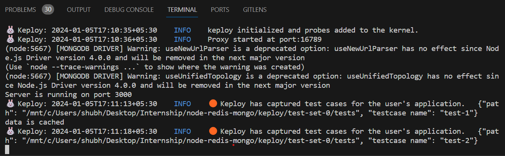

# Node-Mongo-Redis

A simple sample CRUD application to test using Keploy build with Node, Express, Redis and MongoDB.

## Setup application
Clone the repository and move to express-mongo folder
```bash
git clone https://github.com/keploy/samples-typescript && cd samples-typescript/Sample-Node-Mongo-Redis-app

# Install the dependencies
npm install
```

# Using Keploy :

## Natively on Ubuntu/WSL

Keploy can be installed on Linux directly and on Windows with the help of WSL. Based on your system architecture, install the keploy latest binary release from here:-

#### Linux
1. AMD Architecture
```zsh
curl --silent --location "https://github.com/keploy/keploy/releases/latest/download/keploy_linux_amd64.tar.gz" | tar xz -C /tmp

sudo mkdir -p /usr/local/bin && sudo mv /tmp/keploy /usr/local/bin && keploy
```

<details>
<Summary> 2. ARM Architecture </Summary>


```zsh
curl --silent --location "https://github.com/keploy/keploy/releases/latest/download/keploy_linux_arm64.tar.gz" | tar xz -C /tmp

sudo mkdir -p /usr/local/bin && sudo mv /tmp/keploy /usr/local/bin && keploy
```
</details>

#### Windows Subsystem for Linux (WSL)

On Windows, WSL is required to run Keploy Binary. You must be running Windows 10 version 2004 and higher (Build 19041 and higher) or Windows 11 to use the commands below.

```bash
wsl --install
```
Once installed download and Install "Keploy Binary" :

```bash
curl --silent --location "https://github.com/keploy/keploy/releases/latest/download/keploy_linux_amd64.tar.gz" | tar xz -C /tmp

sudo mkdir -p /usr/local/bin && sudo mv /tmp/keploy /usr/local/bin && keploy
```

Or you can use Keploy's One Click Install by running this command in WSL-2 terminal:

```bash
curl -O https://raw.githubusercontent.com/keploy/keploy/main/keploy.sh && sh keploy.sh
```
A folder named Keploy will appear on your folder structure after properly installing Keploy.
### Let's start the MongoDB Instance
#### Prequisite for starting Docker
- Download Docker Desktop
- Go to settings in Docker Desktop and choose WSL 2 in engine
- Make sure you have the correct Dockerfile and docker-compose.yml file.
```zsh
docker-compose up -d
```
Now you will see this in your terminal\
``` Server running on port 3000 ```  

### Capture the testcases

```bash
keploy record -c 'node server.js'
```

#### Let's generate the testcases.
Make API Calls using [Hoppscotch](https://hoppscotch.io), [Postman](https://postman.com) or cURL command. Keploy with capture those calls to generate the test-suites containing testcases and data mocks.

- For Postman reuqest 

```
Use POST HTTP verb

URL : http://localhost:3000/todos

Body : 
{
    "title": "Todo's Title", 
    "description": "Todo's Description"
}
```



*Voila!! Created your first set of test cases 🌟*