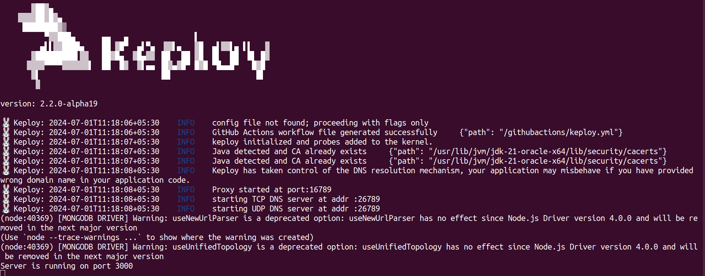
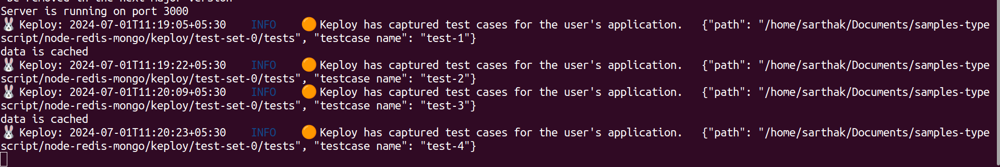
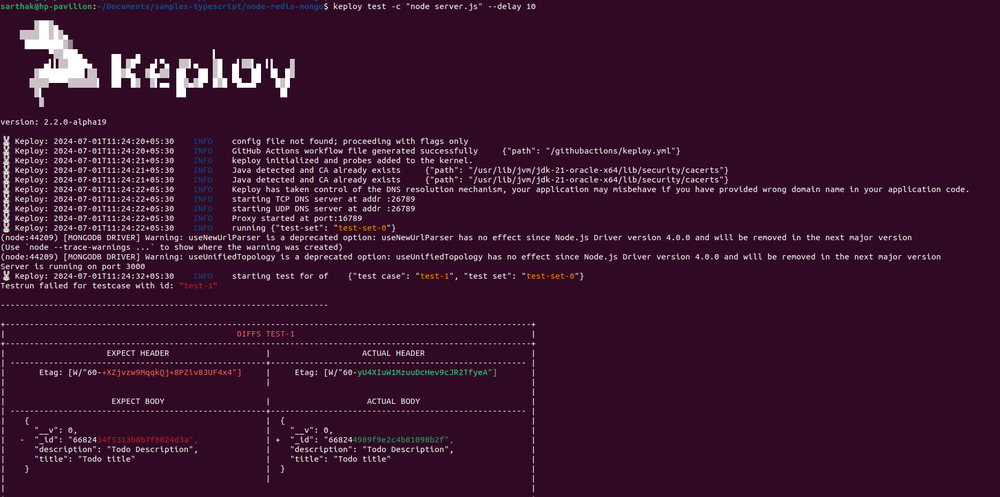
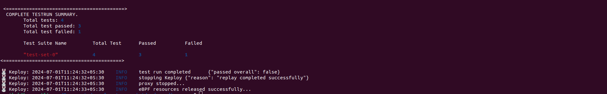

# Node-Mongo-Redis

A simple sample CRUD application to test using Keploy build with Node, Express, Redis and MongoDB.

## Setup application
Clone the repository and move to express-mongo folder
```bash
git clone https://github.com/keploy/samples-typescript && cd samples-typescript/node-redis-mongo

# Install the dependencies
npm install
```

# Using Keploy :

## Natively on Ubuntu/WSL

Keploy can be installed on Linux directly and on Windows with the help of WSL. Based on your system architecture, install the keploy latest binary release from here:-

#### Linux

Let's get started by setting up the Keploy alias with this command:

```bash
curl --silent -O -L https://keploy.io/install.sh && source install.sh
```

#### Windows Subsystem for Linux (WSL)

On Windows, WSL is required to run Keploy Binary. You must be running Windows 10 version 2004 and higher (Build 19041 and higher) or Windows 11 to use the commands below.

Let's get started by setting up the Keploy alias with this command:

```bash
curl --silent -O -L https://keploy.io/install.sh && source install.sh
```


### Capture the testcases

```bash
keploy record -c 'node server.js'
```

#### Let's generate the testcases.
Make API Calls using [Hoppscotch](https://hoppscotch.io), [Postman](https://postman.com) or cURL command. Keploy with capture those calls to generate the test-suites containing testcases and data mocks.

- For cURL reuqest 

```
POST Todos request:

curl --location --request POST 'http://localhost:3000/todos' \
--header 'Content-Type: application/json' \
--data-raw '{
    "title" : "Todo title",
    "description" : "Todo Description"
}'

```

```
GET Todos request:

curl http://localhost:3000/todos
```
```
GET Todos By Id request:

curl http://localhost:3000/todos/{id}
```

```bash
UPDATE Todo by id :

curl -X PUT -H "Content-Type: application/json" -d '{"title": "Todo Title", "description": "Todo Description"}' http://localhost:3000/todos/{id}

```

```bash
DELETE Todo by id :

curl -X DELETE http://localhost:3000/todos/{id}
```



Congrats on the journey so far! You've seen Keploy's power, flexed your coding muscles, and had a bit of fun too! Now, go out there and keep exploring, innovating, and creating! Remember, with the right tools and a sprinkle of fun, anything's possible.😊🚀

## 🏃 Running Testcases
```bash
keploy test -c "node server.js" --delay 10
```
we will get a result similar to this



Summary



## Wrapping it up 🎉

Congratulations! You've conquered Keploy and unleashed its power for effortless testing in your NodeJS application. Time to go forth and build amazing things! 🧑🏻‍💻
