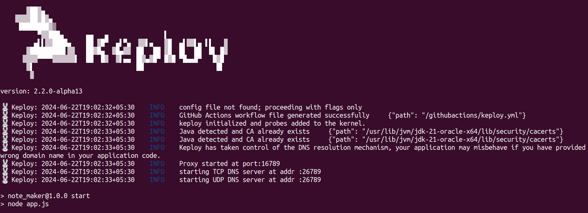

# QuickWrites

The QuickWrites is a simple web application built with Express.js for managing notes with user authentication. Users can sign up, log in, create, view, and delete notes.

## Features

- User authentication: Sign up, log in, and log out functionality with JWT tokens.
- Create, view, and delete notes: Users can create new notes, view their own notes, and delete notes they no longer need.
- Secure authentication: JWT tokens are used for user authentication and authorization.
- Error handling: Proper error handling for authentication failures and other errors.

## Prerequisites

- Node.js installed on your machine
- MongoDB Atlas account or a local MongoDB database.

## Install Keploy
Install keploy via one-click:-

```bash
curl --silent -O -L https://keploy.io/install.sh && source install.sh
```

## Setup application
Clone the repository and move to express-mongo folder
```bash
git clone https://github.com/keploy/samples-typescript && cd samples-typescript/rest-express-mongo

# Install the dependencies
npm install
```
## Running test cases in Keploy:

`keploy record -c "npm start"`

We will get the following output in the terminal



#### Let's generate the testcases.

Make API Calls using [Hoppscotch](https://hoppscotch.io), [Postman](https://postman.com) or cURL command. Keploy with capture those calls to generate the test-suites containing testcases and data mocks.

```bash
curl --request POST \
  --url http://localhost:3000/ \
  --header 'content-type: application/json' \
  --data '{
    "title": "Sample Note",
    "body": "This is the body of the note",
    "username": "testuser"
}'
```

🎉 Easy right! Just one API call and you've whipped up a test case with a mock. Check out the Keploy directory to find your shiny new `test-1.yml` and `mocks.yml` files.

## Run keploy test

Want to see it in action? Run the following command to execute your Keploy tests

```bash
keploy test -c "npm run" --delay 10
```

Great job following along 🥳! Now, let's dive deeper and explore how to do Keploy integration with jest test 📌

## Get Keploy jest sdk

```bash
npm i @keploy/sdk nyc jest
```

## Update package file

Update the `package.json` file that runs the application:

```json
 "scripts": {
    //other scripts
    "test": "jest --coverage --collectCoverageFrom='src/**/*.{js,jsx}'",
    "coverage": "nyc npm test && npm run coverage:merge && npm run coverage:report",
    "coverage:merge": "mkdir -p ./coverage && nyc merge ./coverage .nyc_output/out.json",
    "coverage:report": "nyc report --reporter=lcov --reporter=text"
    //other scripts
  }
```

## Usage

For the code coverage for the keploy API tests using the jest integration, you need to add the following test to your Jest test file. It can be called as `keploy.test.js`. Jest test file. It can be called as `keploy.test.js`.

```javascript
const {expect} = require("@jest/globals");
const keploy = require("@keploy/sdk");
const timeOut = 300000;

describe(
  "Keploy Server Tests",
  () => {
    test(
      "TestKeploy",
      (done) => {
        const cmd = "npm start";
        const options = {};
        keploy.Test(cmd, options, (err, res) => {
          if (err) {
            done(err);
          } else {
            expect(res).toBeTruthy(); // Assert the test result
            done();
          }
        });
      },
      timeOut
    );
  },
  timeOut
);
```

Now let's run jest tests along keploy using command

```bash
npm test
```

To get Combined coverage with keploy test coverage

```bash
npm run coverage
```

## Wrapping it up 🎉

Congratulations! You've conquered Keploy and unleashed its power for effortless testing in your NodeJS application. With Jest by your side, you can ensure rock-solid code coverage. Time to go forth and build amazing things! 🧑🏻‍💻

## Use cases

- Sign up for a new account to get started.
- Log in with your credentials to access your notes.
- Create new notes, view existing ones, and delete notes as needed.
- Log out when you're done.

### Postman Test Cases

Here are the test cases written for Postman:

1.  **Checks whether the response status code is 200, indicating a successful request**: pm.test("Response should have status 200", function () { pm.response.to.have.status(200); });
2.  . **Checks whether requesting with an unknown user should result in a response with a status code of 500, possibly indicating an internal server error.** pm.test("Unknown user should get a response 500", function () { pm.response.to.have.status(500); });
3.  **Checks whether providing a wrong password results in a response with a status code of 500.** pm.test("Wrong password should have status code 500", function () { pm.response.to.have.status(500); });
